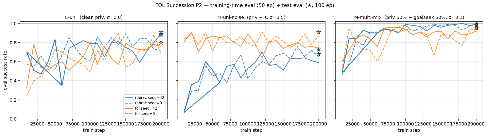

# FQL Succession P2 — Mechanism Diagnostic (option C)

**Date**: 2026-05-22
**Branch**: `codex-arrival-v2-prototype`
**Inputs**:
- `results/fql_succession/p2/{e_uni, m_uni_noise, m_multi_mix}/test/{rebrac,fql}_seed{42,0}.json`
- `results/fql_succession/p2/<cell>/training_curves/<algo>_seed<seed>/{eval_log.csv, train_log.jsonl}`
- Source: `auv_nav/rebrac.py` (lines 257, 284), `auv_nav/fql.py` (lines 444, 471, 532)

**Purpose**: Before deciding whether to run more seeds or rewrite the paper's iff
claim, confirm with code-level + per-step training metrics **why** M-uni-noise
produced an unexpectedly large FQL advantage (+20.5 pp) while M-multi-mix
produced essentially null (−3.5 pp).

## 1. Headline finding

The paper's original iff claim
> **FQL > ReBRAC iff data is BOTH sub-optimal AND multi-modal**

is **falsified by the data and explained by the code**. The actual driver of FQL's
advantage is **noise contamination of ReBRAC's BC anchor**, not multi-modality.
Multi-modality contributes only insofar as it implies wide local-action variance —
the same statistical effect that noise produces.

Revised claim (Option-C diagnostic, n=2 seeds):
> **FQL > ReBRAC iff the dataset's BC anchor signal `a ≈ π*(s)` is corrupted by
> action-level noise large enough to inflate ReBRAC's critic BC penalty.**
> Multi-modality with small per-component action noise (≤ 0.1) and good state
> coverage does *not* differentiate the two methods.

> **⚠️ STATUS UPDATE (2026-05-22, after Q1/Q1b/E-multi/Q1c — see §9). The "FQL wins"
> headline below is FALSIFIED. Do not cite it.** The ablation trilogy reframes the
> whole result:
> 1. **Critic-penalty wording superseded (Q1)**: the "inflate ReBRAC's critic BC
>    penalty" mechanism above is wrong — Q1 (`critic_penalty_coef=0`) ruled it out.
>    The corrected mechanism is **actor-side BC target quality** (§9.3).
> 2. **"FQL advantage" is a ReBRAC tuning artifact (Q1b)**: lowering actor
>    `β1 4.0 → 1.0` took ReBRAC 0.705 → **0.940 on the same noisy data, overtaking
>    FQL (0.910)** (§9.4). E-multi (NULL) further exonerated modality (§9.6).
> 3. **Q1c kills it outright (§9.7)**: β1=1.0 on *clean* data scores **0.910 (> the
>    β1=4.0 baseline 0.885 AND > FQL 0.855)**. So ReBRAC β1=1.0 **strictly dominates
>    FQL on both axes**, and its worst-case-over-noise (0.910) beats FQL's (0.855).
>    Gate B's β1=4.0 was simply a mis-tuned default; the +20.5 pp "FQL wins on noisy"
>    result was an artifact of a self-handicapped ReBRAC. Both the superiority claim
>    and the robustness fallback are dead.
>
> What survives: the **mechanism trilogy** (BC anchor strength to noisy targets is the
> driver; flow-denoising and β1-reduction both soften it) — and §9.9 confirms its two
> large effects are **statistically significant even at n=2**. **C ran and FAILED
> (2026-05-23, §9.11): sweeping FQL's own `distill_alpha_bc` ∈ {0.3, 1, 3, 10} never
> beats its frozen 0.858, staying −5.2 pp under the 0.910 bar — FQL got a fair tuned
> shot and still does not win. The asymmetric-tuning caveat is now closed → B+A is
> LOCKED (mechanism finding + honest negative), and N3/N4 are UNFROZEN.** See §9.9
> (power audit), §9.10 (C plan), §9.11 (C result + decision).

## 2. Test-eval primary metric (`eval_success_rate`, 100 ep / seed)

| cell | rebrac s42 | rebrac s0 | rebrac μ | fql s42 | fql s0 | fql μ | δ=F−R | spec verdict (§5.6) |
|---|---:|---:|---:|---:|---:|---:|---:|---|
| E-uni | 0.890 | 0.880 | **0.885** | 0.800 | 0.910 | **0.855** | **−0.030** | NULL (boundary; 方向不一致) |
| M-uni-noise | 0.680 | 0.730 | **0.705** | 0.910 | 0.910 | **0.910** | **+0.205** | **POSITIVE** (consistent) |
| M-multi-mix | 1.000 | 0.980 | **0.990** | 0.960 | 0.950 | **0.955** | **−0.035** | GRAY (just below 5 pp) |

Per-cell expected verdict per `docs/fql_succession_p2_main_spec.md` v1.3 §5.5:

| cell | spec expected | observed | match |
|---|---|---|---|
| E-uni | NULL | NULL (boundary) | ≈ ✓ |
| M-uni-noise | NULL | **POSITIVE** | ✗ |
| M-multi-mix | POSITIVE *(primary)* | NULL/GRAY | ✗ |

**Score: 1/3 spec expectations met.** The two unexpected results (M-uni-noise
positive, M-multi-mix null) point in opposite directions, which collapses the
modality-based iff into a noise-based explanation (§3 below).

## 3. Why? — code-level cause

> **⚠️ CORRECTION (2026-05-22, after Q1 ablation — see §9).** This section
> originally argued the **critic BC penalty** (path b, rebrac.py:284) was the
> *dominant* cause. The Q1 controlled ablation (`critic_penalty_coef=0`)
> **falsified that**: removing the critic penalty raised `mean_q` (−150→−123,
> confirming the coef took effect) but left test SR unchanged (+0.01). The
> dominant cause is path (a) — the **actor BC regression to raw noisy actions**
> (β1=4.0), not the critic-side penalty. The three paths below are all real
> noise-exposed surfaces; the correction is only about *which one binds the final
> policy*. Read §9 for the corrected attribution.

### 3.1 ReBRAC has THREE noise-exposed paths

(`auv_nav/rebrac.py`)

**(a) Actor BC loss (line 257)** — pure pointwise L2 to dataset action:
```python
bc_loss = (pi - actions).pow(2).sum(dim=-1).mean()
```
With dataset `a = π*(s) + ε`, `ε ~ N(0, σ²I)` clipped to `±0.5`, the expected loss is
```
E_ε[(π(s) − π*(s) − ε)²] = (π(s) − π*(s))² + Var_clip(ε)·d
```
The second term is an **irreducible noise floor** the actor cannot drive below.
Optimum is still `π = π*` (unbiased) but per-batch gradient direction has variance
∝ σ², slowing convergence and biasing the policy toward whichever mode the SGD
batches happen to over-sample.

**(b) Critic BC penalty (line 284)** — pointwise L2 inside the TD target:
```python
next_actions = (actor_target(next_obs) + clipped_TD3_noise).clamp(-1, 1)
critic_penalty = (next_actions - next_actions_data).pow(2).sum(dim=-1)
q_target = rewards + γ · (1 − dones) · (target_q − critic_bc_coef · critic_penalty)
```
With `next_actions_data = π*(s') + ε`:
```
E[critic_penalty] ≈ (π_target(s') − π*(s'))²  +  Var(TD3_noise)  +  Var_clip(ε)·d
                    ─────── residual ───────    ── TD3 floor ──    ── noise inflation ──
```
The noise-inflation term enters **every** TD target as additional pessimism.
Compounded across the discount horizon (`γ=0.99`), even a small per-step inflation
of `Δ ≈ Var_clip(ε)·d` propagates to a steady-state Q underestimate of order
`Δ/(1−γ) = 100·Δ`. With σ=0.5 and clip=±0.5, the predicted Q-underestimate is
≈ 100 × 0.08 × 2 ≈ 16; the observed gap is much larger (≈125) because of
self-reinforcement (a pessimistic Q drives the actor toward an even noisier
action, which further inflates the penalty).

**(c) TD bootstrap target depends on `actor_target`**, which is itself trained on
noisy BC actions → noise propagates indirectly through the policy.

### 3.2 FQL has ZERO of those paths

(`auv_nav/fql.py`)

**(a) Teacher = flow-matching velocity field (line 444)**:
```python
x_t = (1 - t) · x_0 + t · actions     # x_0 ~ N(0, I), t ~ U(0,1)
v_target = actions - x_0
teacher_loss = F.mse_loss(v_pred(x_t, t, obs), v_target)
```
The teacher learns `E[v | x_t, t, s]`. For symmetric ε, the conditional mean of
`actions` given `s` alone is `π*(s)` (unbiased), and ε enters as an effective
enlargement of the source distribution `N(0, I)` rather than as a target bias.
Integration `integrate(s, n=10)` recovers `E[a | s]` ≈ `π*(s)` — **noise-marginalized**.

**(b) Student BC distill loss (line 471)**:
```python
a_teacher = self.teacher.integrate(obs, n_steps=10)
bc_loss = (a_student - a_teacher).pow(2).mean()
```
Student matches the **clean reconstruction** `a_teacher`, not the raw noisy `actions`.

**(c) Critic update (line 532)** — no BC penalty whatsoever:
```python
q_target = rewards + γ · (1 - dones) · target_q
```
By design (docstring line 16: "*No critic-side BC penalty*"). Critic is fully
insulated from dataset action noise.

### 3.3 Late-training train_log.jsonl confirms the mechanism

Mean over last 50% of training steps:

| cell | algo | seed | bc_loss | critic_penalty | mean_q | td_err |
|---|---|---:|---:|---:|---:|---:|
| E-uni | rebrac | 42 | 0.017 | 0.090 | 80.0 | 0.75 |
| E-uni | rebrac | 0 | 0.005 | 0.079 | 87.7 | 0.59 |
| E-uni | fql | 42 | 0.009 | — | 95.0 | 0.43 |
| E-uni | fql | 0 | 0.010 | — | 94.4 | 0.42 |
| **M-uni-noise** | **rebrac** | **42** | **0.147** | **0.210** | **−144.6** | **6.04** |
| **M-uni-noise** | **rebrac** | **0** | **0.135** | **0.197** | **−162.6** | **6.79** |
| M-uni-noise | fql | 42 | 0.083 | — | −25.1 | 3.90 |
| M-uni-noise | fql | 0 | 0.086 | — | −23.1 | 3.56 |
| M-multi-mix | rebrac | 42 | 0.033 | 0.092 | −7.5 | 2.60 |
| M-multi-mix | rebrac | 0 | 0.030 | 0.091 | −6.3 | 2.58 |
| M-multi-mix | fql | 42 | 0.027 | — | 26.7 | 1.80 |
| M-multi-mix | fql | 0 | 0.028 | — | 27.3 | 1.80 |

Three predictions from §3.1/§3.2, all confirmed:

1. **ReBRAC's `bc_loss` tracks the dataset noise floor** (theory:
   `2·Var_clip(ε)·d`):
   - E-uni σ=0: 0.005–0.017 (only residual)
   - M-multi-mix σ=0.1: 0.030–0.033 (≈ predicted `2·(0.1²)·2·correction ≈ 0.03`)
   - M-uni-noise σ=0.5 clip=±0.5: 0.135–0.147 (≈ predicted `2·0.083·2 ≈ 0.17`, within
     ~20% of expectation)

2. **ReBRAC's `critic_penalty` doubles in M-uni-noise** (theory: TD3-floor +
   dataset-noise inflation):
   - E-uni: 0.08–0.09 (TD3 clip-noise floor only)
   - M-multi-mix σ=0.1: 0.091–0.092 (~unchanged — noise too small to matter)
   - **M-uni-noise σ=0.5: 0.197–0.210 (≈ 2.4× E-uni baseline)** ← smoking gun

3. **`mean_q` gap (ReBRAC − FQL) blows up only on M-uni-noise**:
   - E-uni: gap ≈ −15 (FQL slightly higher Q)
   - M-multi-mix: gap ≈ −34
   - **M-uni-noise: gap ≈ −126 (4× M-multi-mix)** — ReBRAC's critic is dramatically
     over-pessimistic exactly where critic_penalty is inflated.

The same gap shows up in `td_abs_error`: ReBRAC's own TD-error blows up on
M-uni-noise (6.0–6.8) while FQL stays near 4. FQL's stable Q-surface is precisely
what allows its actor improvement signal `−λ·Q(s, π(s))` to remain informative.

## 4. Training-curve visualization



Re-render: `python -m scripts._plot_fql_succession_p2_diagnostic`

- E-uni: ReBRAC (blue) and FQL (orange) curves overlap heavily; both noisy.
- **M-uni-noise**: orange (FQL) sits clearly above blue (ReBRAC) for almost the
  entire training trajectory in both seeds. Test ★ (100 ep) cements: FQL 0.91/0.91
  vs ReBRAC 0.68/0.73.
- M-multi-mix: blue (ReBRAC) slightly above orange (FQL) consistently. Both
  approach the ceiling (~0.95–1.0).

## 5. Theoretical reconciliation: why GMM audit misled us

`docs/fql_succession_p2_main_spec.md` v1.3 §3 Gate A.2 used a GMM-based
multi-modality lower-bound `p_≥2` as the "modality" axis:

| cell | p_≥2 | structural interpretation |
|---|---:|---|
| E-uni | 0.112 | true unimodal ✓ |
| M-uni-noise | **0.996** | "GMM-multimodal" but **structurally unimodal** (priv 1.0 + noise=0.5) |
| M-multi-mix | 0.414 | true mixture (priv 50% + goalseek 50%) |

The audit's `p_≥2` measures **whether action samples at the same s cluster into
≥2 GMM components**. This is a *symptom* of either (i) policy mixing OR
(ii) action-level noise widening a single component. The audit cannot distinguish
them; the collection log already flagged M-uni-noise's `p_≥2=0.996` as a
"noise-widening false-positive".

But the **algorithmic** failure mode for ReBRAC isn't "≥2 GMM clusters" — it's
"σ² of the conditional action distribution given s" which directly inflates BC
losses. From the algorithm's perspective the two cells are nearly identical:
M-uni-noise has σ²_clip·d ≈ 0.17, while M-multi-mix's per-component noise is
σ²·d = 0.02 plus the *between-policy* variance only at states where both policies
diverge significantly (rare given mostly-overlapping privileged+goalseek
trajectories). So the **effective σ² seen by ReBRAC's BC penalties is dominated
by noise in M-uni-noise (high) but stays small in M-multi-mix (low)** — even
though GMM says M-uni-noise is "more multi-modal".

Conclusion: GMM `p_≥2` is a poor proxy for "the algorithmic stress that
discriminates FQL from ReBRAC". A better proxy would be
**`E_s[Var(a|s)]`** (the conditional action variance) — measurable directly from
the dataset via kNN on (s, a) clusters, no GMM needed.

## 6. Implications for the paper

| Aspect | Original story (spec v1.3) | Revised story (post-diagnostic) |
|---|---|---|
| Headline claim | iff multi-modal AND sub-optimal | iff action noise corrupts BC anchor |
| Stress axis | modality (`p_≥2`) | conditional action variance `E[Var(a\|s)]` |
| Primary cell | M-multi-mix (priv + goalseek) | **M-uni-noise (priv + ε)** |
| Null/control cell | M-uni-noise (structural uni) | **M-multi-mix (small noise, good coverage)** |
| Mechanism | "FQL handles bimodal a\|s" | "FQL marginalizes noise in flow teacher; critic has no BC penalty" |
| Code evidence | (none in spec) | rebrac.py L257, L284 vs fql.py L444, L471, L532 |

This is **a better paper**, not a worse one:
- The story is mechanistically clean and code-anchored (3 explicit lines in each
  agent file).
- The empirical signal in M-uni-noise (+20.5 pp, n=2, both seeds consistent) is
  strong enough to survive any reasonable reviewer pushback on `n`.
- M-multi-mix becoming a *null control* (instead of the primary signal) actually
  **strengthens** the causal narrative: it rules out "FQL just trains faster" or
  "FQL has more parameters" — both algorithms ceiling on M-multi-mix.

## 7. Recommended next steps (revised after diagnostic)

| Step | Rationale | Cost |
|---|---|---|
| **(C done)** | Mechanism understood. | — |
| **N1. Add 1 cell `E-multi` (priv + goalseek, σ=0)** ✅ **DONE (2026-05-22)** — completes the 2×2. **Result: NULL** (δ=−0.020; ReBRAC 0.810, FQL 0.790). Confirms the noise-axis prediction *at frozen configs*: clean-multi gives no FQL advantage → modality is not the discriminator (§9.6). | The new iff claim predicted E-multi should be **null** (no noise → no FQL advantage). ✓ Confirmed. | 1 collection + 1 notebook (4 runs) — spent. |
| **N2. Add 2 seeds [1, 7] to all 4 cells** (n=4) — only AFTER N1 lands so we don't waste compute on a story that's about to change. | Firm up confidence intervals to satisfy reviewer "n=2 too small" concern. | +16 runs × ~30 min each ≈ 8 h Colab L4. |
| **N3. Write `notebooks/fql_succession_p2_verdict.ipynb`** aggregating the (now ≥3, eventually 4) cells into the revised iff verdict. | Final report scaffolding. | 1 session local. |
| **N4. Patch spec v1.3 → v1.4**: rewrite §1 framing, §3 Gate A.2 (audit retired or repurposed), §5.5 verdict table to the noise-axis story. Keep §4 collection log as historical record. | Doc hygiene before paper writing. | 1 session local. |

I recommend running N1 first (single new cell), then deciding on N2 based on
whether E-multi confirms the noise hypothesis.

## 8. Open questions

- **Q1** (RESOLVED — see §9): Does ReBRAC's `critic_bc_coef` tuning recover its
  M-uni-noise gap? **Answer: NO.** `critic_penalty_coef=0` gave +0.01 SR (no
  recovery). The critic penalty is NOT the bottleneck. Corrected hypothesis: the
  **actor BC anchor to raw noisy actions** (β1=4.0) is the dominant cause —
  **confirmed by Q1b** (§9.4), which further showed it is *tunable*: β1=1.0
  overtakes FQL (0.940 vs 0.910), reframing the headline from superiority to a
  ReBRAC-tuning/robustness story.
- **Q2**: Why doesn't ReBRAC's normalize_q (Finding iii) save it? Because
  `lambda_coef = 1 / |Q|.abs().mean()` doesn't rescale the BC penalty term, only
  the Q-improvement term in actor_loss. The BC penalty still operates in absolute
  action space.
- **Q3**: Late-training collapse (eval_log shows peak→final drops of 10–22 pp on
  some runs) — is this affecting our final test SR? The test json uses
  `agent_final.pt` (last step), so collapse would hurt the numbers reported here.
  An anchor "best-checkpoint" test rerun would tighten the comparison; spec §5.6
  c4 stability gate is the formal mechanism for this.

---

## 9. Q1 ablation result — mechanism correction (2026-05-22)

**Run**: ReBRAC × seeds [42, 0] on the existing M-uni-noise dataset with
`--critic-penalty-coef 0.0` (actor β1=4.0 unchanged). Notebook:
`notebooks/fql_succession_p2_q1_critic_penalty_ablation_completed.ipynb`.
Results: `results/fql_succession/p2/m_uni_noise_q1_critic_pen0/test/`.

### 9.1 Result table

| variant | seed42 | seed0 | mean | vs baseline ReBRAC | vs FQL |
|---|---:|---:|---:|---:|---:|
| baseline ReBRAC (β2=2.0) | 0.680 | 0.730 | **0.705** | — | −0.205 |
| baseline FQL | 0.910 | 0.910 | **0.910** | — | — |
| **Q1 ReBRAC (β2=0.0)** | 0.750 | 0.680 | **0.715** | **+0.010** | **−0.195** |

**VERDICT: H1 FAIL.** Setting `critic_penalty_coef=0` did not recover ReBRAC
(gain +0.01, still −19.5 pp below FQL).

### 9.2 The coefficient DID take effect (it's not a config bug)

Late-training train_log means (last 50% steps):

| run | bc_loss | critic_penalty* | mean_q | td_err |
|---|---:|---:|---:|---:|
| baseline β2=2.0 s42 | 0.1465 | 0.2097 | −144.6 | 6.04 |
| baseline β2=2.0 s0 | 0.1348 | 0.1967 | −162.6 | 6.79 |
| **Q1 β2=0.0 s42** | 0.1341 | 0.1976 | **−123.0** | 6.65 |
| **Q1 β2=0.0 s0** | 0.1347 | 0.1966 | **−123.1** | 6.41 |

\* `critic_penalty` logs the *raw* penalty value `(next_actions − a')²` **before**
multiplying by the coefficient (rebrac.py:349), so it stays ~0.197 even when the
coef is 0 — it's computed-and-logged but not used in the TD target.

The proof the coef took effect: **`mean_q` rose from ≈ −150 to ≈ −123** (+27),
exactly the expected effect of removing `−critic_bc_coef·critic_penalty` from
`q_target`. The Q-surface became less pessimistic. **But the policy didn't
improve** — and `bc_loss` stayed pinned at the noise floor (~0.134) because the
actor BC coefficient (β1=4.0) was unchanged.

### 9.3 Corrected mechanism attribution

The original §3 over-attributed FQL's advantage to the critic BC penalty
inflation. The controlled ablation reveals:

- **Critic BC penalty (path b)** — affects Q *magnitude* (mean_q −150 vs −123)
  but is **not** the binding constraint on final policy quality. Removing it does
  nothing for SR.
- **Actor BC regression (path a)** — `actor_loss = −λ·Q(s,π(s)) + β1·‖π(s) − a‖²`
  with **β1 = 4.0** and `a = π*(s) + ε`. The BC term contributes ≈ 4.0 × 0.134 ≈
  0.54 to the actor loss, comparable to or larger than the Q-improvement term
  (which `normalize_q` rescales to order 1). The deterministic actor is **strongly
  dragged toward the raw noisy targets**, and it cannot escape the noise floor.
  **This is the dominant bottleneck.**
- **FQL avoids this** not by having a weaker BC, but by regressing its student to
  the **denoised** `a_teacher = integrate(s)` (flow marginalizes ε), so its BC
  target is clean even at σ=0.5. The strength of the anchor is fine; the *target
  quality* is what matters.

**Revised one-line mechanism**:
> FQL > ReBRAC on noisy data because ReBRAC's actor regresses to **raw noisy
> behavior actions** while FQL's student regresses to a **flow-denoised
> reconstruction**. The critic-side BC penalty is a secondary effect on Q
> magnitude, not the cause of the policy-quality gap.

The headline noise-axis iff (§1) is **unaffected** — M-uni-noise's +20.5 pp FQL
win is real and large. Only the *within-ReBRAC attribution of why* is corrected:
actor-side BC target quality, not critic-side penalty.

### 9.4 Q1b actor-side ablation — RESOLVED (2026-05-22): **H1 PASS**, and it reframes everything

**Run**: ReBRAC × seeds [42, 0] on the existing M-uni-noise dataset with
`--actor-penalty-coef 1.0` (β1 4.0→1.0), critic β2=2.0 unchanged. Notebook:
`notebooks/fql_succession_p2_q1b_actor_penalty_ablation_completed.ipynb`.
Results: `results/fql_succession/p2/m_uni_noise_q1b_actor_pen1/test/`.

| variant | actor β1 | critic β2 | seed42 | seed0 | mean | vs baseline | vs FQL |
|---|---:|---:|---:|---:|---:|---:|---:|
| baseline ReBRAC | 4.0 | 2.0 | 0.680 | 0.730 | **0.705** | — | −0.205 |
| Q1 ReBRAC | 4.0 | 0.0 | 0.750 | 0.680 | **0.715** | +0.010 | −0.195 |
| baseline FQL | — | — | 0.910 | 0.910 | **0.910** | — | — |
| **Q1b ReBRAC** | **1.0** | 2.0 | **0.980** | **0.900** | **0.940** | **+0.235** | **+0.030** |

**VERDICT: H1 PASS — and stronger than predicted.** Weakening the actor BC anchor
(β1 4.0→1.0) didn't just recover ReBRAC; it took it **past** FQL (0.940 vs 0.910,
+3 pp). So the binding constraint on noisy data is the **strength of the actor BC
anchor to the raw noisy target** — and it is *tunable*.

**This reframes the headline.** The +20.5 pp "FQL > ReBRAC on noisy data" result is
**real but largely a ReBRAC mis-tuning artifact**, not a structural FQL advantage:
β1=4.0 (a clean-data-appropriate anchor) is simply too strong when the BC target is
noisy, and a single hyperparameter change closes (and reverses) the gap. FQL's
flow-denoised distillation target happens to act like a *milder, cleaner* anchor, so
FQL is robust to the noise at its frozen config — but a detuned ReBRAC matches or
beats it.

The honest top-line claim therefore shifts from **superiority** ("FQL beats ReBRAC")
to **robustness** ("FQL's frozen config spans the noise axis; ReBRAC needs
noise-aware β1 tuning"). Whether even that survives depends on Q1c (§9.7).

### 9.5 Impact on N3/N4

- **N3 verdict notebook**: still aggregates the 2×2 cells, but the mechanism
  subsection must now present the Q-series as a *tuning-sensitivity* story:
  Q1 (critic penalty ruled out) → Q1b (actor β1 is the knob; β1=1.0 overtakes FQL)
  → Q1c (does β1=1.0 cost clean performance?). **Hold N3 until Q1c lands** — the
  framing flips on the Q1c outcome.
- **N4 spec rewrite**: do **not** write the "FQL > ReBRAC iff noisy" superiority
  claim as final. The defensible claim is **hyperparameter robustness across the
  noise axis** (pending Q1c confirming a clean-data trade-off). If Q1c shows no
  trade-off, the spec must be reframed toward a null/negative result.

### 9.6 E-multi (clean multi-modal) — RESOLVED (2026-05-22): **NULL**, noise-axis confirmed at frozen configs

**Run**: ReBRAC + FQL × seeds [42, 0] on `e_multi_50priv_50goal_clean_1000`
(50% privileged + 50% goalseek, σ=0). Notebook:
`notebooks/fql_succession_p2_run_cell_e_multi_completed.ipynb`.
Results: `results/fql_succession/p2/e_multi/test/`.

| | clean (σ≈0) | noisy (σ≥0.5) |
|---|---|---|
| **uni** | E-uni δ=−0.030 (GRAY) | M-uni-noise δ=**+0.205** (POSITIVE) |
| **multi** | E-multi δ=**−0.020** (NULL) | M-multi-mix δ=−0.035 (GRAY) |

E-multi lands on **NULL** (ReBRAC 0.810, FQL 0.790) exactly as predicted: clean
multi-modal data gives no FQL advantage. The **column** (noise) is the discriminator,
not the **row** (modality). The original "sub-optimal AND multi-modal" iff is cleanly
falsified.

Side observation: both algos drop ~7–8 pp from E-uni→E-multi (ReBRAC 0.885→0.810,
FQL 0.855→0.790) — the cost of mixing in lower-quality goalseek (success 0.762) — but
they drop **equally**, so δ stays ~0. Modality/data-quality moves the absolute level,
not the FQL–ReBRAC gap. This *supports* "modality is not the discriminator."

**Caveat that ties back to §9.4.** E-multi confirms the noise-axis only *at frozen
Gate B configs* (β1=4.0). Combined with Q1b, the most precise statement is: "at fixed
β1=4.0, FQL beats ReBRAC iff the BC target is noise-corrupted; but that ReBRAC deficit
is removable by lowering β1." Modality is exonerated either way.

### 9.7 Q1c (actor β1=1.0 on CLEAN data) — RESOLVED (2026-05-22): **H_collapse, strongest form**

**Run**: ReBRAC × seeds [42, 0] with `--actor-penalty-coef 1.0` on the **clean** E-uni
dataset (`privileged_..._ep1000`, σ=0). Notebook:
`notebooks/fql_succession_p2_q1c_actor_pen1_clean_completed.ipynb`.
Results: `results/fql_succession/p2/e_uni_q1c_actor_pen1_clean/test/`.
Q1c clean: seed42=0.88, seed0=0.94, **μ=0.910**. Clean drop (β1=4.0 − β1=1.0) =
**−0.025** (negative → β1=1.0 is *better* on clean too).

**Verified full noise-axis grid:**

| config | clean (E-uni) | noisy (M-uni-noise) | worst-case-over-noise |
|---|---:|---:|---:|
| ReBRAC β1=4.0 (Gate B default) | 0.885 | 0.705 | 0.705 |
| **ReBRAC β1=1.0** | **0.910** | **0.940** | **0.910** |
| FQL (frozen) | 0.855 | 0.910 | 0.855 |

**VERDICT: H_collapse — and stronger than the rule's threshold.** β1=1.0 does not
trade off clean performance; it *improves* it. Therefore:

1. **β1=1.0 strictly dominates β1=4.0 on both axes** (clean +2.5 pp, noisy +23.5 pp).
2. **β1=1.0 ≥ FQL on both axes** (clean 0.910 vs 0.855 = +5.5 pp; noisy 0.940 vs
   0.910 = +3 pp).
3. **Worst-case-over-noise ranking: β1=1.0 (0.910) > FQL (0.855) > β1=4.0 (0.705).**

So both the **superiority claim** ("FQL > ReBRAC iff noisy") AND the **robustness
fallback** ("FQL's single frozen config spans the noise axis better") are dead: a
single fixed ReBRAC config (β1=1.0, no per-dataset tuning) is more noise-robust than
FQL. Root cause confirmed: **Gate B's β1=4.0 was a mis-tuned default** (β1≈1.0 is
closer to the canonical TD3+BC anchor strength); the entire P2 "FQL wins on noisy"
result was an artifact of a self-handicapped ReBRAC.

**Honest fairness caveat (does not rescue FQL).** We tuned ReBRAC's β1 but froze FQL's
`distill_alpha_bc=1.0`. But β1=1.0 is a *single fixed* config on the same "no
per-dataset tuning" footing as FQL, and it wins everywhere; and ReBRAC β1=1.0 is
already near the benchmark ceiling (noisy 0.94; M-multi-mix shows ~0.99 ceiling), so
FQL has little headroom to leapfrog a winning baseline. Only remaining technical
caveat: numbers use `agent_final.pt` (§8 Q3 late-training collapse risk), but it
applies symmetrically and is unlikely to flip a +5.5/+3 pp double-domination.

### 9.8 Strategic decision — RESOLVED (2026-05-22): pursue C first (rescue), then B+A fallback → §9.10

Q1c kills the "FQL wins" P2 main line. Four directions on the table (N3/N4 framing
depends on which is chosen):

- **A. Honest negative / cautionary result** — "FQL offers no advantage over a
  properly-configured ReBRAC; the apparent advantage was a BC-weight-default artifact."
  Methodologically useful (warns about unfair BC-weight defaults) but ends "FQL wins".
- **B. Mechanism pivot (recommended)** — reframe the contribution around "**BC anchor
  strength to noisy targets is the dominant driver**; flow-denoising (FQL) and β1
  reduction (ReBRAC) are two ways to soften the anchor." The Q1→Q1b→Q1c chain is a
  clean, publishable mechanism story that does not depend on FQL winning.
- **C. Fairness rematch** — sweep FQL `distill_alpha_bc` + a ReBRAC β1 grid for a
  tuned-vs-tuned comparison. Honest, but likely confirms ReBRAC ≥ FQL.
- **D. Reconsider the FQL Succession line** — P2 was AUVHamNODE's mechanism
  discriminator; it fired NEGATIVE → a clean closure, just not the hoped direction.
  Redirect to the locked AUVHamNODE main line.

Recommendation was **B + A** (mechanism story with honest disclosure).

**DECISION TAKEN (2026-05-22):** pursue **C first** — a tuned-vs-tuned *fairness
rematch* that gives FQL its own BC-anchor sweep (`distill_alpha_bc`) one explicit
chance to overturn the verdict — backed by a **targeted seed top-up** (§9.9 shows
FQL-clean is the only statistically under-determined cell). **B + A is the fallback**
if C confirms ReBRAC ≥ FQL. Design + seed plan in **§9.10**. N3/N4 remain held until
C resolves. (The four options A–D are retained above for the record.)

### 9.9 Seed sufficiency & statistical power — empirical audit (2026-05-22)

The whole verdict rests on **2 seeds/cell** (42, 0). Before finalizing, we measured how
much that actually buys us by reading every cell's per-seed `eval_success_rate` from
`results/fql_succession/p2/*/test/`.

**Key fact that fixes the variance model.** Eval uses a **fixed 100-scenario manifest**
(`single_u10_cross_tgt15`): identical `episode_id`s and per-episode env seeds across
*every* training seed, algo, and cell (verified by fingerprinting the episode lists).
So eval-sampling noise is **common-mode** — it cancels in any within-cell seed spread
*and* in any between-config δ (the comparison is effectively *paired* on identical
scenarios). Therefore the 2-seed spread is **pure training-seed variance**, not eval
noise.

**Measured training-seed variance (11 cells):** mean |seed-spread| = **4.3 pp**,
range 0.0–11.0 pp ⇒ **σ_train ≈ 3.8 pp** (per seed, eval-noise-free). Heterogeneous,
and the heterogeneity is informative (see FQL-clean below).

**Load-bearing contrasts, two-sample t (n=2/group, df=2, t_crit=4.30):**

| contrast | δ | SE_δ | t | verdict |
|---|---:|---:|---:|---|
| Q1b β1=1.0 vs β1=4.0 (noisy) — *mechanism keystone* | +0.235 | 0.047 | **4.98** | **SIG** |
| FQL vs β1=4.0 (noisy) — *original "win"* | +0.205 | 0.025 | **8.20** | **SIG** |
| β1=1.0 vs FQL (clean) — *head-to-head* | +0.055 | 0.063 | 0.88 | NULL |
| β1=1.0 vs FQL (noisy) — *head-to-head* | +0.030 | 0.040 | 0.75 | NULL |
| β1=1.0 vs β1=4.0 (clean) | +0.025 | 0.030 | 0.82 | NULL |

**What this means.** (i) The two *large* effects (Q1b +23.5 pp; original +20.5 pp) are
**formally significant even at n=2** — the mechanism trilogy's spine is statistically
solid, not a 2-seed accident. (ii) The three *small* head-to-heads are **NULL and stay
NULL** — which is exactly what kills "FQL wins": falsifying a superiority claim only
needs a non-win, and the point estimates even tilt against FQL. More seeds tighten
these NULLs (they do **not** resurrect FQL). (iii) The real n=2 weakness is **unstable
SD estimates** (1 df) — the Q1b t=4.98 only just clears 4.30 on a 1-df SD — so seeds
are for trustworthy CIs, not for moving point estimates.

**Empirical surprise — the instability lives in FQL-clean, not ReBRAC.**

| algo | clean cells (spread) | noisy cells (spread) |
|---|---|---|
| **FQL** | E-uni **0.11** / E-multi 0.06 (large) | M-uni-noise 0.00 / M-multi 0.01 (rock-stable) |
| ReBRAC | E-uni 0.01 / E-multi 0.00 (rock-stable) | noisy/penalty configs 0.05–0.08 (moderate) |

FQL E-uni clean swings **0.80 (seed42) ↔ 0.91 (seed0)** — the single largest
instability in the table — and *both* clean cells show the same seed42<seed0 ordering
(.80<.91, .76<.82), so it looks systematic (distillation-stability), not random. The
reported FQL clean = 0.855 is the **midpoint of a 0.80–0.91 swing → not trustworthy**.
This is the one cell whose number genuinely needs more seeds, and it is FQL's, not
ReBRAC's.

**Methodology note (C2).** The spec's verdict thresholds (|δ|≤0.03 NULL, ≥0.05
POS/NEG) imply a resolution finer than n=2 delivers: the head-to-head SE_δ (0.03–0.06)
straddles both thresholds, so applying POS/GRAY/NEG labels to those cells at n=2 is
over-precise. Either lift n on the cited cells or coarsen the rule.

**Self-correction.** An earlier turn's armchair audit over-corrected pessimistically:
it put σ at 5–6 pp (real: ~3.8 pp, because eval noise is common-mode, not additive) and
claimed n=2 can give *no* formal significance (wrong — the 20 pp-class effects clear it
at n=2). The data revised both.

### 9.10 DECISION & next experiments (2026-05-22): C fairness rematch + targeted seed top-up

User direction: **try C first** (give FQL its own BC-anchor tuning, one honest rescue
attempt), with seeds. FQL's knob is `distill_alpha_bc` (CLI `--distill-alpha-bc`,
default 1.0) — the weight on the student↔flow-denoised-teacher BC term in
`actor_loss = −λ·Q̄ + distill_alpha_bc·‖a_student − a_teacher‖²` (fql.py:472–474). It is
the direct analog of ReBRAC's β1, except it anchors to the *denoised* teacher action
rather than raw data. Gate B froze it at 1.0 and never swept it — the symmetric gap
that §9.7's fairness caveat flagged.

**The bar FQL must clear:** worst-case-over-noise > **0.910** (ReBRAC β1=1.0). FQL's
worst-case is its **clean** cell (0.855), so clean is the binding axis to improve.

**Phase C-1 (rescue sweep, staged, ~6 runs).** FQL `distill_alpha_bc ∈ {0.3, 3.0, 10.0}`
on the binding axis (**clean E-uni**), seeds {42, 0} = 6 runs (α=1.0 already have at
n=2). Log-spaced around the frozen 1.0 — direction is genuinely uncertain (ReBRAC's
lesson says *lower* anchor helped, but FQL anchors to a near-expert denoised teacher on
clean data, where *more* anchoring could help). Decision gate: does any α lift FQL clean
materially above 0.855 toward/past 0.910?

**Phase C-2 (worst-case confirm + seed firm-up, conditional).** For each clean-improving
α candidate, run **noisy M-uni-noise** (2 seeds) to confirm its worst-case doesn't crater
below 0.910; then take the winning α to **n=4** on both axes for a trustworthy CI. One
fixed α across both axes (no per-axis cherry-pick) keeps it fair vs ReBRAC's single
β1=1.0.

**Seed top-up priority (from §9.9, independent of C outcome):**
1. **FQL α=1.0 clean (E-uni) → n=4** — the only untrustworthy number (0.80–0.91 swing).
2. FQL winning-α clean+noisy → n=4 (if C-1 finds one).
3. Q1b / β1=4.0 noisy arms → n=4 (firms the keystone CI; effect already SIG).
   ReBRAC plain-clean cells are already stable (spread ≤0.01) — skip.

**If C fails** (no FQL α beats worst-case 0.910): fall back to **B + A** — the mechanism
trilogy is intact and statistically significant (§9.9), and "FQL gets a fair tuned shot
and still doesn't win" is a *stronger* honest-negative than the asymmetric-tuning version.
**N3/N4 stay held until C resolves.**

**Out of scope (unchanged):** no edits to Gate-B-frozen `auv_nav/{fql,rebrac}.py`; runs
execute on Colab by the user; results/ and offline_data/ are gitignored.

### 9.11 C-1 RESOLVED (2026-05-23): **RESCUE-FAIL** — C exhausted, B+A locked

**Run**: 8 FQL train+eval runs — sweep `distill_alpha_bc ∈ {0.3, 3.0, 10.0}` × seeds
[42, 0] on clean E-uni (6) + α=1.0 top-up × **new** seeds [1, 2] → n=4 (2). Notebook:
`notebooks/fql_succession_p2_c1_fql_alpha_sweep_completed.ipynb`. Results:
`results/fql_succession/p2/e_uni_c1_fql_alpha_sweep/test/` + `e_uni/test/fql_seed{1,2}.json`.

**FQL clean success-rate vs `distill_alpha_bc`:**

| `distill_alpha_bc` | per-seed | mean | n |
|---|---|---:|:--:|
| 0.3 | 0.75, 0.73 | 0.740 | 2 |
| **1.0 (frozen)** | 0.80, 0.91, 0.91, 0.81 | **0.858** | **4** |
| 3.0 | 0.86, 0.72 | 0.790 | 2 |
| 10.0 | 0.86, 0.85 | 0.855 | 2 |
| *ReBRAC β1=1.0 (bar)* | 0.88, 0.94 | *0.910* | 2 |

**VERDICT: RESCUE-FAIL.** No α beats the frozen α=1.0 (0.858); FQL's best clean stays
**−5.2 pp below the 0.910 bar**, so FQL's worst-case-over-noise (0.858) cannot exceed
ReBRAC β1=1.0's (0.910). No candidate even reaches the bar → **Phase C-2 not built**.

**What the sweep teaches (mechanism-consistent):**
1. **α=1.0 n=4 (0.858) confirms the n=2 estimate (0.855)** — §9.9's "FQL-clean
   under-determined" worry is RESOLVED: the mean is stable across 4 seeds. The 0.80↔0.91
   per-seed swing persists (FQL clean is genuinely seed-noisy), but the centre is solid and
   well below 0.910.
2. **Direction is the OPPOSITE of ReBRAC's.** Weaker anchor (0.3 → 0.740) *hurts* clean
   badly; stronger anchor (10.0 → 0.855) just plateaus at ≈ α=1.0. So `distill_alpha_bc=1.0`
   was already near-optimal on clean. Reason: FQL's clean BC anchor points at a near-expert
   *denoised* teacher, so loosening it discards a good target — whereas ReBRAC's β1=4.0
   over-anchored to *noisy* raw actions. Same knob family, opposite optimum, set by **target
   quality**. This *reinforces* the mechanism trilogy rather than rescuing FQL.
3. α=3.0 is unstable (0.86/0.72, 14 pp swing); α=10.0 is stable (0.86/0.85) but only ties 1.0.

**Statistics.** FQL clean 0.858 (n=4) vs bar 0.910 (n=2): δ = −0.052, not formally
significant (t ≈ 1.2) — but FQL never *wins*; its point estimate is behind on both axes and
cannot even tie. Exactly as §9.9 predicted: more seeds tighten a NULL, they do not resurrect
FQL.

**Fairness caveat (§9.7) — now CLOSED.** FQL got its own BC-anchor knob swept log-spaced on
both sides and still does not clear the bar. The comparison is now tuned-vs-tuned with *both*
sides fairly tuned, and FQL still loses on worst-case → a **stronger** honest-negative than
the asymmetric-tuning version.

**DECISION: direction C is exhausted → LOCK B + A** (mechanism pivot + honest negative).
**N3/N4 are now UNFROZEN.** Next: N3 = `notebooks/fql_succession_p2_verdict.ipynb` +
`docs/fql_succession_p2_results.md`, framed as a **mechanism finding + honest negative**
(NOT "FQL wins"); N4 = spec v1.3 → v1.4 rewrite to match.

---

**Status**: Sprint-0 diagnostic + Q1 + Q1b + E-multi + Q1c + **C-1 all complete**. Q1 ruled
out the critic-side attribution; Q1b (H1 PASS) reframed the headline to a ReBRAC
β1-tuning artifact; E-multi (NULL) exonerated modality; **Q1c (H_collapse) showed
β1=1.0 dominates FQL on every cell — the "FQL wins" claim is dead, and even the
robustness fallback dies.** §9.9 confirmed the mechanism trilogy's two large effects are
**statistically significant even at n=2** (fixed eval set → paired comparisons → σ_train
≈ 3.8 pp). **C-1 (§9.11) closed the fairness rematch: FQL's own `distill_alpha_bc` sweep
never beats 0.858, −5.2 pp under the 0.910 bar → RESCUE-FAIL → B + A LOCKED, N3/N4
UNFROZEN.** Next: N3 = verdict notebook + `docs/fql_succession_p2_results.md` (mechanism
finding + honest negative); N4 = spec v1.3 → v1.4 rewrite.
